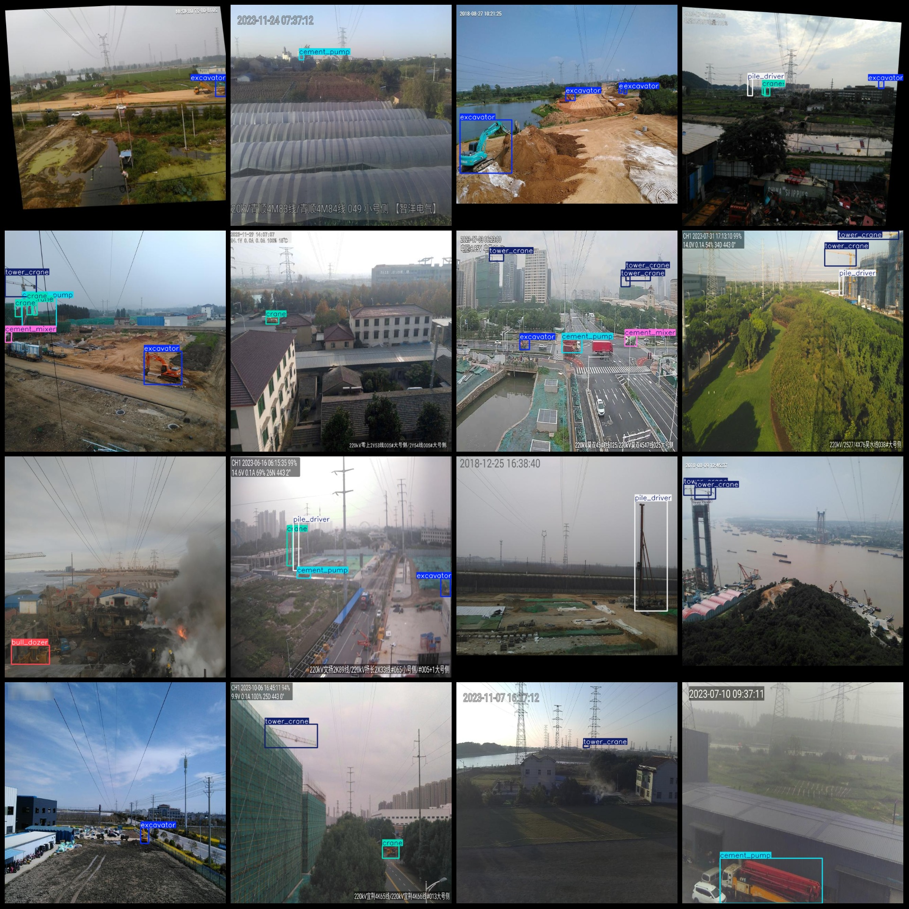
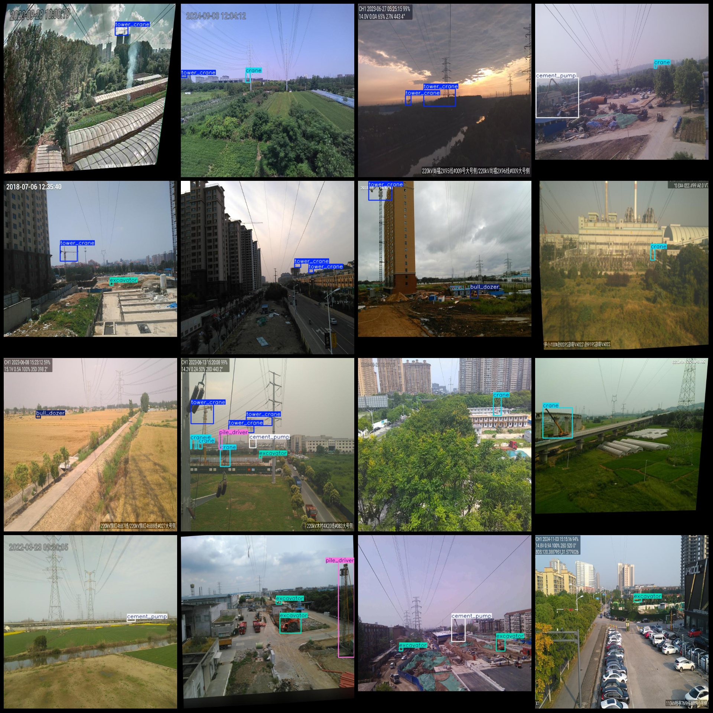

# Power Scene: Transmission Line Protection and Vehicle Detection Dataset in VOC+YOLO Format with 1866 Images of 7 Classes

The dataset consists of 1866 images, with a significant number of them being vehicles near high-voltage lines. The format of the data is Pascal VOC plus Yolo, with only txt files containing the jpg images and their corresponding VOC xml and Yolo txt files.

The number of images (jpg file count) is 1866.
The number of labels (xml file count) is 1866.
The number of labels (txt file count) is 1866.
The number of label categories: 7.
The names of the label categories (note that the order in the Yolo format does not correspond to this, but refer to the "labels" folder's "classes.txt" as the standard): ["bull_dozer", "cement_mixer", "cement_pump", "crane", "excavator", "pile_driver", "tower_crane"].
The number of boxes for each category:
For bull_dozer (backhoe): 307 boxes.
For cement_mixer (mixer truck): 234 boxes.
For cement_pump (concrete pump truck): 314 boxes.
For crane (hoist): 967 boxes.
For excavator (excavator): 887 boxes.
For pile_driver (pile driver): 239 boxes.
For tower_crane (tower crane): 966 boxes.
Total frame count: 3914.
Image resolution: 640x640.
Is the dataset enhanced: The dataset contains partial enhancements mainly rotation-enhanced images.
Use the annotation tool: labelImg.
Rules of annotation: Label categories with rectangles.
Important Notice: No.
Special Disclaimer: This dataset does not guarantee the accuracy of trained models or weight files.
Preview of the image:
## Images

Here is a pay link on Stripe ( https://buy.stripe.com/3cs8yP7sY87d0vu9AB ). Please contact me lonlonago@foxmail.com after funding $89, and I will send you a complete data files , thank you!

